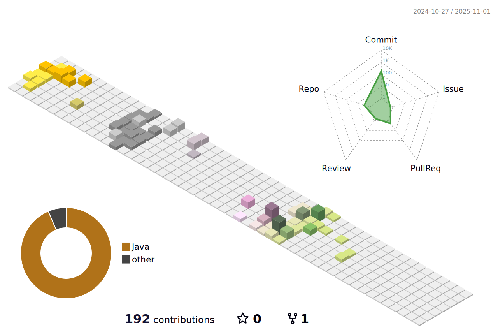

  
<!--  -->

<!-- <h3 align="center">🛠 Teck Stack 🛠</h3>

  </a>&nbsp
<!--    -->
  </a>&nbsp</a>
  
  
  
   
<!--   </a>&nbsp -->
<!--   </a>&nbsp -->
<!--   </a>&nbsp -->
  
<!--   </a>&nbsp -->
   
  </a>&nbsp
<!--   </a> -->
  
  

 -->

 

